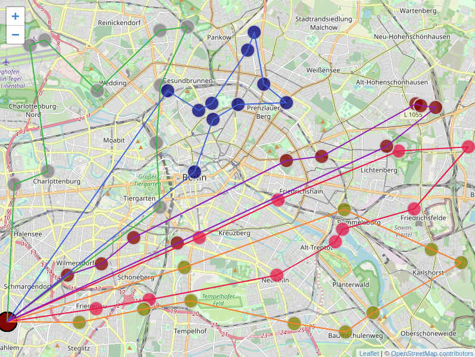

# Description

This project provides the way to solve multiple variations of **Vehicle Routing Problem** known as rich VRP.


# Getting started

Please check documentation [here](https://reinterpretcat.github.io).


# Design goal

Although performance is constantly in focus, the main idea behind design is extensibility: the project
aims to support a wide range of VRP variations known as Rich VRP. This is achieved through various extension
points: custom constraints, objective functions, acceptance criteria, etc. Additionally, the project can be seen as
playground for experiments with various metaheuristic algorithms.


# How to use

VRP solver is built in Rust. To install it, use `cargo install` or pull the source code from `master`.


## Install from source

Once pulled the source code, you can build it using `cargo`:

```bash
cargo build --release
```

Built binaries can be found in the `./target/release` directory.


## Install from Cargo

You can install vrp solver `cli` tool directly with `cargo install`:

```bash
cargo install vrp-cli
```

Ensure that your `$PATH` is properly configured to source the crates binaries, and then run solver using the `vrp-cli` command.


## Use from command line

`vrp-cli` crate is designed to use on problems defined in scientific or custom (aka 'pragmatic') format:

```bash
vrp-cli solve pragmatic problem_definition.json -m routing_matrix.json --max-time=120`
```

Please refer to crate docs for more details.


## Use from code

If you're using rust, then you can simply use `vrp-solver`, `vrp-scientific`, `vrp-pragmatic` crates to solve VRP problem
defined in 'pragmatic' or 'scientific' format using default metaheuristic. For more complex scenarios, please refer to
`vrp-core` documentation.

If you're using some other language, e.g java, please check `examples` to see how to call the library from it.
Additionally, `vrp-pragmatic` crate can be build into `WebAssembly` and then used from modern web browser.


# Status

Experimental.